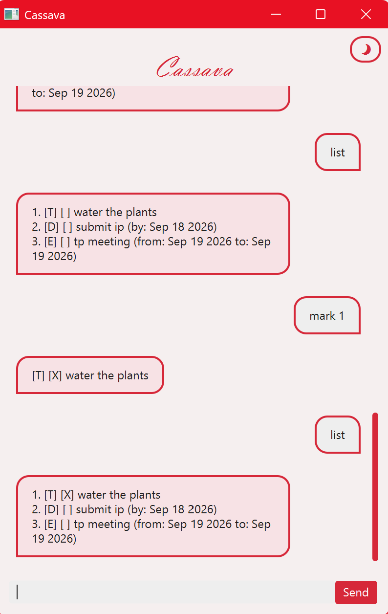

# Cassava User Guide



Cassava is a desktop application for managing tasks. 
It can help you track todos, deadlines and even events!

## Quick Start

1. Ensure you have Java 17 or above installed.
2. Download the latest `cassava.jar` from [here]([INSERT_RELEASE_LINK](https://github.com/geraldnyeo/ip/releases/)).
3. Copy the file to the folder you want to use as the home folder for Cassava.
4. Open a terminal in that folder and run: `java -jar cassava.jar`
5. The GUI should appear. Type any command in the input box and press Enter or click Send to try it out.
6. Refer to the [Features](#features) below for details on each command.

## Features

### Adding a ToDo

Adds a ToDo to your task list. *(A ToDo is a task which only has a description.)*

Command: `todo (task description)`

Example: `todo water the plants` 
* Adds a ToDo: 'water the plants'.

### Adding a Deadline

Adds a Deadline to your task list. *(A Deadline is a task with a date to complete it by.)*

Command: `deadline (task description) \by (yyyy-mm-dd)`

Example: `deadline submit assignment \by 2026-09-18` 
* Adds a Deadline: 'submit assignment'.
* The due date is 2026-09-18.

### Adding an Event

Adds an Event to your task list. *(An Event is a task with a start and end date.)*

Command: `event (task description) \from (yyyy-mm-dd) \to (yyyy-mm-dd)`

Example: `event festival \from 2026-09-19 \to 2026-09-20`
* Adds an Event: 'festival'.
* The start date is 2026-09-19.
* The end date is 2026-09-20.

### Listing all Tasks

Shows a list of all your tasks, as well as information about them.

Command: `list`

Output Format:
```
1. [type] [mark] (task description) [priority] (extra info)
2. ...
```
* `[type]` is the type of task, either `T` (ToDo), `D` (Deadline) or `E` (Event).
* `[mark]` indicates whether the task has been completed, either `X` (completed) or blank.
* `[priority]` indicates the priority level of the task, either `low`, `medium`, `high` or blank.
* `(extra info)` includes information such as start, end and due dates. May be blank.

Example: `list`
```
1. [T] [X] water the plants [low]
2. [D] [] submit assignment (by: Sep 18 2026)
3. [E] [] project meeting (from: Sep 19 2026 to: Sep 20 2026) 
```

### Finding Tasks

Shows a list of all tasks containing the search query.

Command: `find (query)`

Output Format: Same as `list`.

Example: `find plant`
```
Here are the matching tasks I found:
1. [T] [X] water the plants [low]
```

### Marking a Task

Marks a task as completed.

Command: `mark (index)`
* Index refers to the list number of the task.

Example: `mark 2`
```
[D] [X] submit assignment (by: Sep 18 2026)
```
* The output shows the task which has been marked.

### Unmarking a Task

Marks a task as incomplete.

Command: `unmark (index)`
* Index refers to the list number of the task.

Example: `unmark 2`
```
[D] [] submit assignment (by: Sep 18 2026)
```
* The output shows the task which has been unmarked.

### Prioritising a Task

Sets a priority level for a task.

Command: `prioritise (index) \level (priority)`
* Index refers to the list number of the task.
* Priority refers to the priority level of the task, either `low`, `medium` or `high`.

Example: `prioritise 1 \level high`
```
[T] [X] water the plants [high]
```
* The output shows the task which has been prioritised.

### Deleting a Task

Deletes a task from the task list.

Command: `delete (index)`
* Index refers to the list number of the task.

Example: `delete 1`
```
[T] [X] water the plants [high]
```
* The output shows the task which has been deleted.

### Exiting the Application

You can either use the close button at the top right of the application window, 
or you can use the `bye` command.

Command: `bye`

### Handling Errors

If you accidentally input an invalid command, or forget some parameters, not to worry!
Cassava will prompt you to correct your mistake with an error message.
You can safely test out commands without worry about losing your task data.

## Settings

### Switching Themes

Cassava supports both dark and light mode! 
Click the toggle button (🌙 / ☀) in the top right hand corner to swap between dark and light mode.
